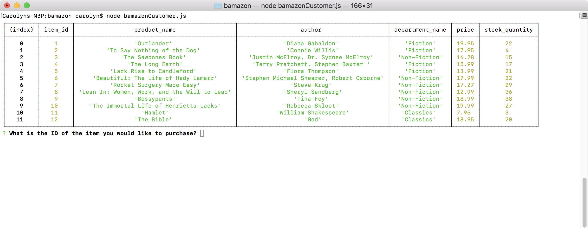
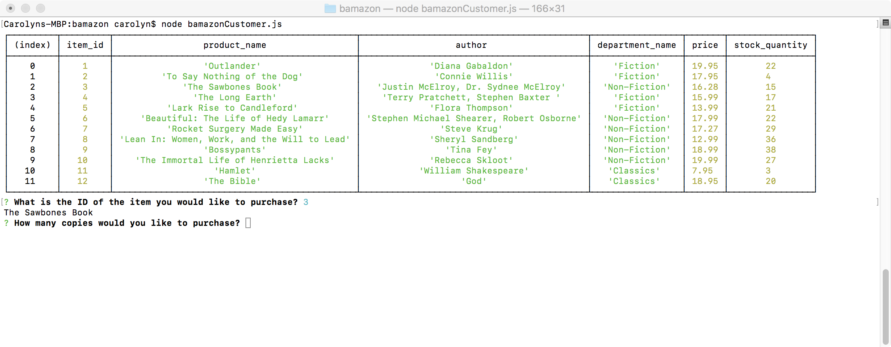
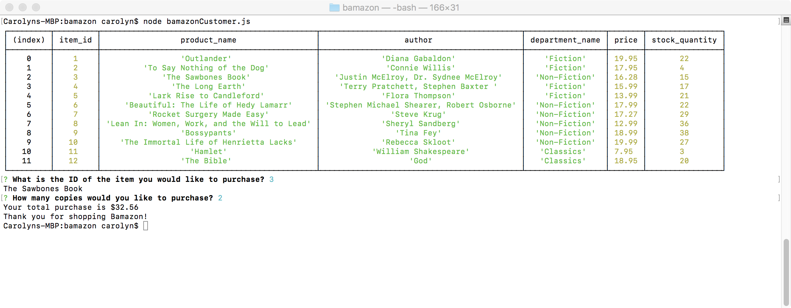
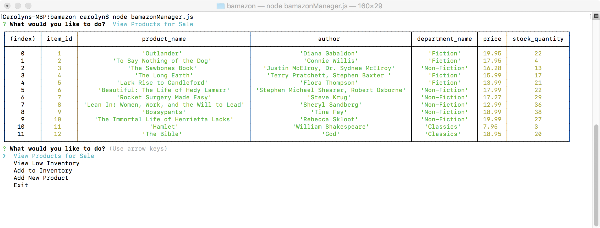
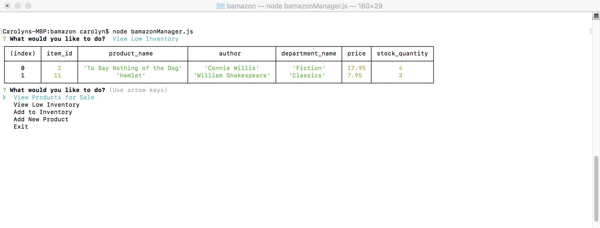
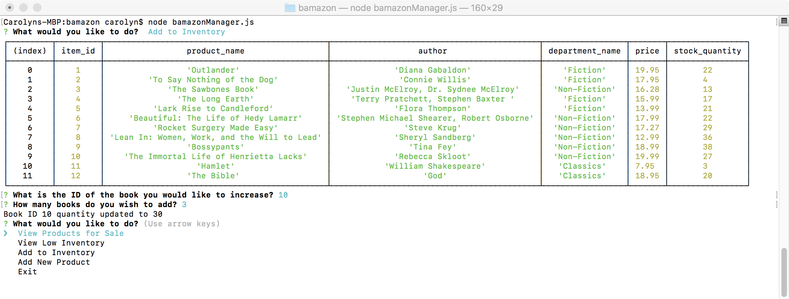
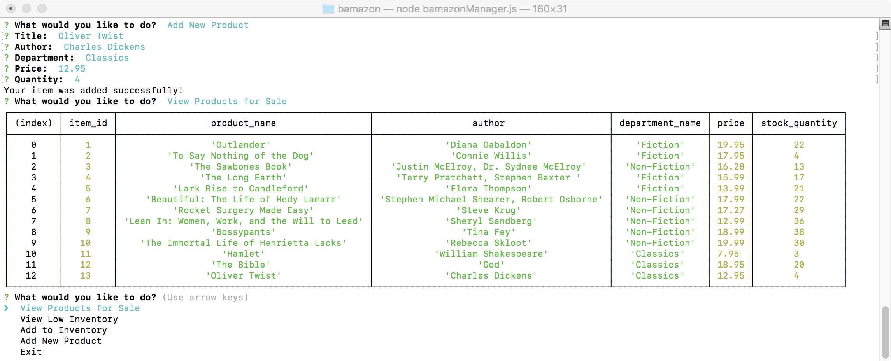

# bamazon
A CLI app that will take in orders from customers and deplete stock from the store's inventory.  The bamazonManager module allows the Manager to view and make changes to the inventory.

## Customer App

The customer app allows the user to view the current inventory and select a book to purchase:

The customer enters the ID number of the desired book.  The app relays the book title and prompts the customer for a quantity to purchase:

Finally, the app subtracts the purchase from inventory and tells the customer how much their total purchase amount is:

## Manager Application

The manager app has additional functionality.  It initializes by prompting the manager with several action choices:

### View Products for Sale
Lists the current inventory of the store.

### View Low Inventory
Lists inventory with 5 or fewer copies in stock.

### Add to Inventory
Allows the manager to increase the stock quantity of a selected item.  The app then confirms the increase by returning the new quantity for the item.

### Add New Product
Prompts manager through adding a new product to the inventory.

